<!-- animated contribution graph: real data, boxes reveal cell by cell
     (regenerated daily by .github/workflows/update-profile-art.yml) -->

<h3><code>venkat@github ~ $ ./contributions.sh</code></h3>

 
 

<h3><code>venkat@github ~ $ whoami</code></h3>

<table>
<tr>
<td valign="top"></td>
<td valign="top"></td>
</tr>
</table>

 
 

<h3><code>venkat@github ~ $ ./links.sh</code></h3>

<b>ML Engineer · Deep Learning · Builder</b>

 

> *"Build → Break → Fix"* – Venkat

 

