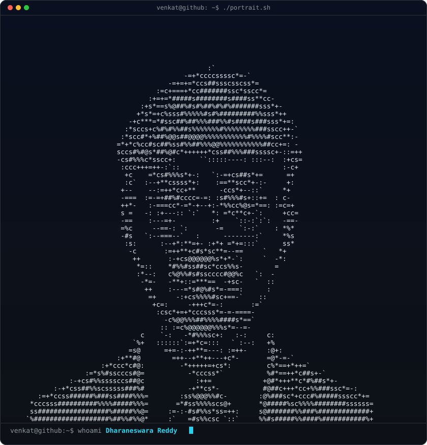
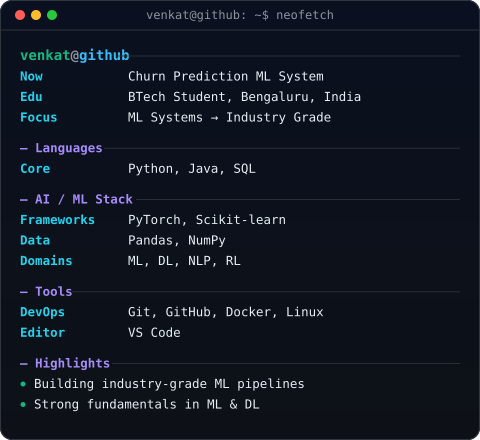
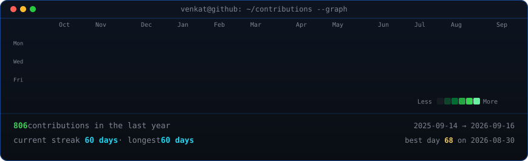

<!-- ===== TERMINAL HERO: PORTRAIT & NEOFETCH CARD ===== -->

<h3><code>venkat@github ~ $ whoami</code></h3>

<table>
<tr>
<td valign="top"></td>
<td valign="top"></td>
</tr>
</table>

 
 

<!-- ===== TERMINAL STATS & METRICS ===== -->

<h3><code>venkat@github ~ $ ./stats.sh</code></h3>

<!-- Streak — full width -->
<picture>
  <source media="(prefers-color-scheme: dark)" srcset="https://streak-stats.demolab.com/?user=Dharaneswara-Reddy&hide_border=true&background=0A101F&stroke=22D3EE&ring=A78BFA&fire=10B981&currStreakLabel=22D3EE&sideLabels=94A3B8&currStreakNum=F8FAFC&sideNums=F8FAFC&dates=64748B&titleColor=22D3EE&card_width=1180" />
  
</picture>

 
 

<!-- Stats + Top languages — side by side -->
<picture>
  <source media="(prefers-color-scheme: dark)" srcset="https://github-readme-stats-sigma-rosy-28.vercel.app/api?username=Dharaneswara-Reddy&show_icons=true&count_private=true&include_all_commits=true&hide_rank=true&hide_border=true&title_color=22D3EE&icon_color=A78BFA&text_color=94A3B8&bg_color=0A101F&card_width=500" />
  
</picture>
&nbsp;
<picture>
  <source media="(prefers-color-scheme: dark)" srcset="https://github-readme-stats-sigma-rosy-28.vercel.app/api/top-langs/?username=Dharaneswara-Reddy&layout=compact&langs_count=8&hide_border=true&title_color=22D3EE&text_color=94A3B8&bg_color=0A101F&card_width=500" />
  
</picture>

 
 

<!-- ===== CONTRIBUTION SNAKE ANIMATION ===== -->

<h3><code>venkat@github ~ $ ./snake.sh</code></h3>

<picture>
  <source media="(prefers-color-scheme: dark)" srcset="https://raw.githubusercontent.com/Dharaneswara-Reddy/Dharaneswara-Reddy/output/snake-dark.svg" />
  <source media="(prefers-color-scheme: light)" srcset="https://raw.githubusercontent.com/Dharaneswara-Reddy/Dharaneswara-Reddy/output/snake-light.svg" />
  
</picture>

 
 

<!-- ===== SOCIAL CONNECT & LINKS ===== -->

<h3><code>venkat@github ~ $ ./connect.sh</code></h3>

<b>ML Engineer · Deep Learning · Systems Builder</b>

&nbsp;&nbsp;

&nbsp;&nbsp;

 
 

> *"Build → Break → Fix"* – Venkat

 

